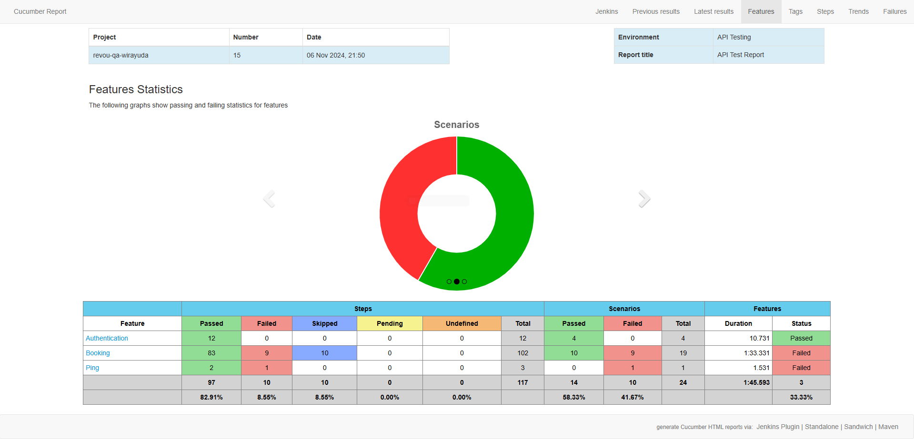
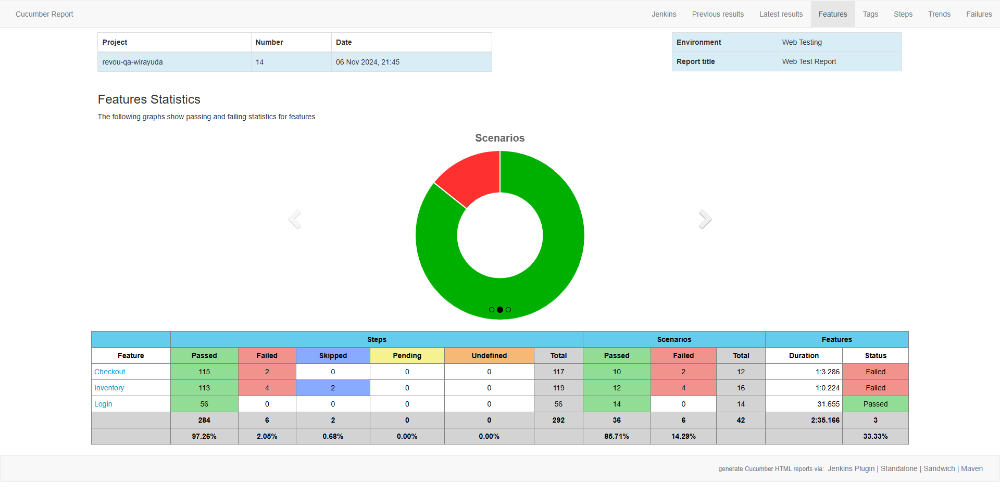
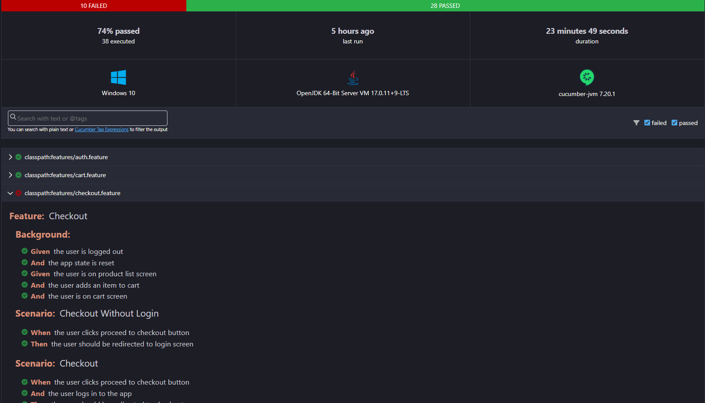

# Milestone Project IT Quality Assurance

## 📋 Gambaran Umum

Proyek ini bertujuan untuk mengimplementasikan *automated testing* untuk API, web, dan mobile, memastikan bahwa seluruh fungsionalitas aplikasi sesuai dengan yang diharapkan, serta mendokumentasikan hasil dari pengujian tersebut. Projek ini menggunakan teknologi sebagai berikut:

- **Pengujian API**: REST Assured
- **Pengujian Web**: Selenium
- **Pengujian Mobile**: Appium

## 🛠️ Implementasi

### API - REST Assured

Pengujian web dilakukan dengan menggunakan *library* REST Assured. Beberapa modul yang diuji pada tes ini antara lain:

- Login (Berhasil & Gagal)
- Booking (*Read*, *Create*, *Update*, *Delete*)
- Ping

### Web - Selenium

Pengujian web dilakukan dengan menggunakan Selenium WebDriver. Beberapa modul yang diuji pada tes ini antara lain:

- Login
- Melihat produk
- Menambahkan produk ke keranjang
- Checkout pesanan

### Mobile - Appium

Pengujian mobile dilakukan dengan menggunakan *library* Appium. Beberapa modul yang diuji pada tes ini antara lain:

- Login
- Melihat produk
- Menambahkan produk ke keranjang
- Checkout pesanan

## 📊 Hasil Pengujian

### API

Tes yang dilakukan pada API meliputi seknario berhasil dan gagal dan pengecekan validasi form.Hasil tes API menunjukkan bahwa sebagian besar *endpoint* telah berfungsi seperti yang diharapkan. Namun, ada beberapa kasus dimana kode status yang diberikan tidak sesuai dengan yang diharapkan.

### Web

Tes yang dilakukan pada web meliputi alur utama yang memungkinkan untuk dilakukan oleh pengguna serta mengecek validasi pada form. Hasil tes web menunjukkan bahwa sebagian besar alur pengguna utama lulus seperti yang diharapkan. Namun, ada beberapa masalah yang perlu diselesaikan seperti pengguna dapat melakukan checkout tanpa barang pada keranjang.

### Mobile

Tes yang dilakukan pada web meliputi alur utama yang memungkinkan untuk dilakukan oleh pengguna serta mengecek validasi pada form. Hasil tes mobile menunjukkan bahwa sebagian besar alur pengguna utama lulus seperti yang diharapkan. Namun, ada beberapa masalah yang perlu diselesaikan seperti validasi pada *form checkout*.

## 🤕 Tantangan

Selama proyek ini, kami menghadapi tantangan berikut:

1. **Kode STATUS API yang tidak konsisten**: Seperti yang disebutkan sebelumnya, masih terdapat beberapa kode status yang diberikan oleh *endpoint* yang masih belum sesuai. Contohnya adalah jika ada kesalahan dalam validasi form, seharusnya menampilakn kode status 400 Bad Request tetapi API memberikan kode status 500 Internal Server Error

2. **Validasi Formulir**: Memastikan bahwa validasi setiap input pada form sudah sesuai agar tidak terjadi kesalahan data. Hal ini meliputi memastikan bahwa input yang perlu diisi memang perlu untuk diisi, serta memastikan apa yang diinput pengguna pada form juga sesuai seperti format kartu kredit harus 16 digit angka tanpa huruf.

## 🚀 Langkah Selanjutnya

Berdasarkan hasil tes dan tantangan yang dihadapi, langkah selanjutnya untuk proyek ini adalah:

- Memperbaiki masalah kode status pada API
- Memperbaiki masalah validasi form pada web dan mobile
- Memperbaiki behavior yang diharapkan pada web dan mobile

Dengan mengatasi hal-hal diatas, diharapkan aplikasi dapat siap untuk diluncurkankepada pengguna dan dapat memberikan pengalaman pengguna yang lancar di semua platform.